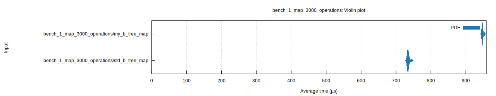
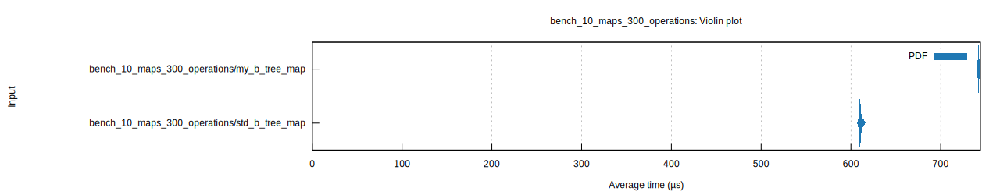
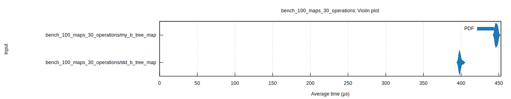
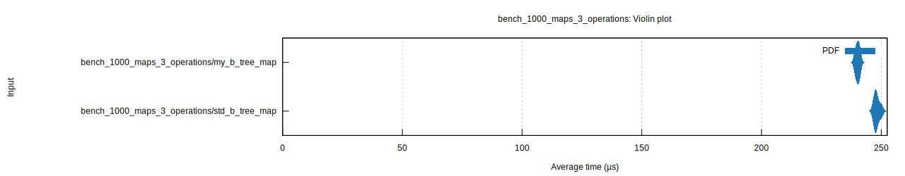
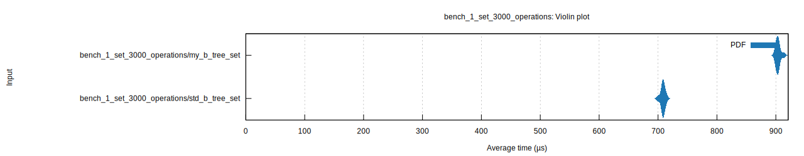
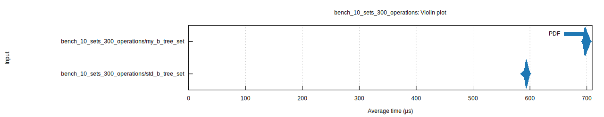
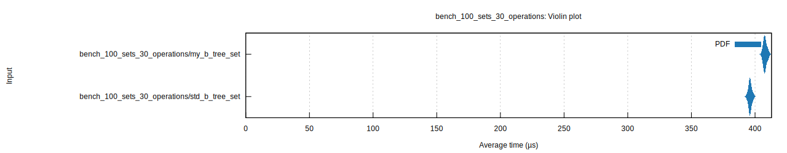
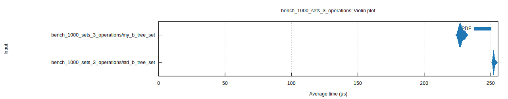

# btree-plus-store: B-trees backed by a slab/arena to reduce allocations and increase locality + copyable, immutable B-trees which must be manually dropped

[](https://github.com/Jakobeha/btree-plus-store/actions)
[](https://crates.io/crates/btree-plus-store)
[](https://github.com/Jakobeha/btree-plus-store#license)
[](https://docs.rs/btree-plus-store)

Forked from [btree-slab](https://github.com/timothee-haudebourg/btree-slab).

## Why would you want this?

You have many b-trees, some of which are very tiny, and want to reduce allocations and increase localization by storing them all in the same memory region.

Or you want [immutable b-trees which can be `Copy`d and share the same memory](https://docs.rs/btree-plus-store/copyable), with the trade-off that you must drop and deallocate their memory via a [manually-invoked tracing gc](https://docs.rs/btree-plus-store/copyable/BTreeStoreExt/function.tracing_gc.html).

## What is it?

`BTreeMap` and `BTreeSet` with an interface almost identical to standard library (with some additional features), but constructed via `new_in(&'a BTreeStore)`.

`BTreeStore` is internally an [arena allocator](https://en.wikipedia.org/wiki/Region-based_memory_management), in that it allocates nodes in large fixed-sized regions; but it's also a [slab allocator](https://en.wikipedia.org/wiki/Slab_allocation), in that it maintains a linked list of allocated and discarded nodes. This means we get the locality benefits of arena allocation but can also reuse storage by dropped b-trees in new b-trees, although the memory won't get reclaimed (usable outside of b-trees) until the arena is destroyed.

Under the `copyable` feature: `copyable::BTreeMap` and `copyable::BTreeSet` are  `Copy`-able, immutable b-trees created from their mutable counterparts. Once created, the memory associated with the mutable b-trees will no longer be automatically reclaimed (since these can be freely copied, we never know if we are deallocating the last one). Instead, there is an unsafe method `tracing_gc`, which lets you manually specify the b-trees which are still live, and any other nodes will be deallocated. 

```rust
use btree_plus_store::{BTreeSet, BTreeStore};
#[cfg(feature = "copyable")]
use btree_plus_store::copyable;

fn main() {
  let store = BTreeStore::new();
  let mut foo_bars: BTreeSet<'_, &'static str> = BTreeSet::new_in(&store);
  let mut alphabeticals: BTreeSet<'_, &'static str> = BTreeSet::new_in(&store);
  
  foo_bars.insert("foo");
  alphabeticals.insert("abc");
  foo_bars.insert("bar");
  alphabeticals.insert("def");
  foo_bars.insert("baz");
  foo_bars.insert("qux");
  alphabeticals.insert("xyz");
  foo_bars.remove(&"baz");
  alphabeticals.remove(&"def");
  for elem in &foo_bars {
      println!("Iterate {}", elem);
  }
  // TODO: retain, drain_filter, intersect, union, difference, and symmetric_difference
  // for elem in alphabeticals.drain_filter(|a| a.starts_with('a')) {
  //     println!("Drain {}", elem);
  // }
  for elem in alphabeticals {
      println!("Consume {}", elem)
  }
    
  #[cfg(feature = "copyable")]
  {
      let foo_bars = copyable::BTreeSet::from(foo_bars);
      let foo_bars2 = foo_bars;
      let foo_bars3 = foo_bars2;
      for elem in &foo_bars {
          assert!(foo_bars2.contains(elem) && foo_bars3.contains(elem));
      }
  }
}
```

## Safety

This library makes heavy use of `unsafe`, although the non-`copyable` tests do pass with MIRI. There are tests for most operations and edge cases, but it's still in the early phase. And since with `std::collections::BTreeMap` and `std::collections::BTreeSet` are available and better in most cases, it shouldn't be used in production.

## Benchmarks

Benchmarks are run for a sequence of operations including insertion, retrieval, iteration, and removal. We vary the # and size of maps and sets.

This library performs slightly faster than `std` on very small maps and sets, but slower otherwise.

[Full Report](criterion/report/index.html)










`copyable` maps and sets are not shown, but their benchmarks should be nearly the same as the non-copyable variants, because they're wrappers.

## License

Licensed under either of

 * Apache License, Version 2.0 ([LICENSE-APACHE](LICENSE-APACHE) or <http://www.apache.org/licenses/LICENSE-2.0>)
 * MIT license ([LICENSE-MIT](LICENSE-MIT) or <http://opensource.org/licenses/MIT>)

at your option.

Forked from [btree-slab](https://github.com/timothee-haudebourg/btree-slab), which is also dual licensed under Apache 2.0 "or" MIT.

### Contribution

Unless you explicitly state otherwise, any contribution intentionally submitted for inclusion in the work by you, as defined in the Apache-2.0 license, shall be dual licensed as above, without any additional terms or conditions.
